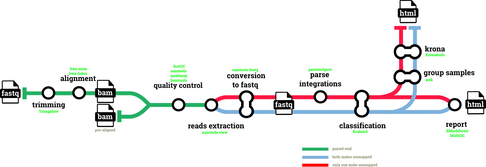

#  

[](https://nf-co.re/hgtseq/results)
[](https://doi.org/10.5281/zenodo.7244734)

[](https://www.nextflow.io/)
[](https://docs.conda.io/en/latest/)
[](https://www.docker.com/)
[](https://sylabs.io/docs/)
[](https://tower.nf/launch?pipeline=https://github.com/nf-core/hgtseq)

[](https://nfcore.slack.com/channels/hgtseq)[](https://twitter.com/nf_core)[](https://mstdn.science/@nf_core)[](https://www.youtube.com/c/nf-core)

## Introduction

**nf-core/hgtseq** is a bioinformatics best-practice analysis pipeline built to investigate horizontal gene transfer from NGS data.

The pipeline uses metagenomic classification of paired-read alignments against a reference genome to identify the presence of non-host microbial sequences within read pairs, and to infer potential integration sites into the host genome.

The pipeline is built using [Nextflow](https://www.nextflow.io), a workflow tool to run tasks across multiple compute infrastructures in a very portable manner. It uses Docker/Singularity containers making installation trivial and results highly reproducible. The [Nextflow DSL2](https://www.nextflow.io/docs/latest/dsl2.html) implementation of this pipeline uses one container per process which makes it much easier to maintain and update software dependencies. Where possible, these processes have been submitted to and installed from [nf-core/modules](https://github.com/nf-core/modules) in order to make them available to all nf-core pipelines, and to everyone within the Nextflow community!

On release, automated continuous integration tests run the pipeline on a full-sized dataset on the AWS cloud infrastructure. This ensures that the pipeline runs on AWS, has sensible resource allocation defaults set to run on real-world datasets, and permits the persistent storage of results to benchmark between pipeline releases and other analysis sources. The results obtained from the full-sized test can be viewed on the [nf-core website](https://nf-co.re/hgtseq/results).

## Functionality Overview

A graphical view of the pipeline can be seen below.

<p align="center">

</p>

## Pipeline summary

1. Read QC ([`FastQC`](https://www.bioinformatics.babraham.ac.uk/projects/fastqc/))
2. Present QC for raw reads ([`MultiQC`](http://multiqc.info/))
3. Adapter and quality trimming ([`Trim Galore`](https://www.bioinformatics.babraham.ac.uk/projects/trim_galore/))
4. Mapping reads using BWA ([`BWA`](http://bio-bwa.sourceforge.net))
5. Sort and index alignments, extraction reads by sam flag and conversion to fastq format([`SAMtools`](https://www.htslib.org))
6. Taxonomic classification ([`Kraken2`](https://github.com/DerrickWood/kraken2/blob/master/docs/MANUAL.markdown))
7. Plotting Kraken2 results ([`Krona`](https://hpc.nih.gov/apps/kronatools.html))
8. Html analysis report ([`RMarkDown`](https://rmarkdown.rstudio.com))

## Usage

> **Note**
> If you are new to Nextflow and nf-core, please refer to [this page](https://nf-co.re/docs/usage/installation) on how
> to set-up Nextflow. Make sure to [test your setup](https://nf-co.re/docs/usage/introduction#how-to-run-a-pipeline)
> with `-profile test` before running the workflow on actual data.

```console
nextflow run nf-core/hgtseq \
--input <YOURINPUT>.csv \
--outdir <OUTDIR> \
--genome GRCh38 \
--taxonomy_id "TAXID" \
-profile <docker/singularity/podman/shifter/charliecloud/conda/institute> \
--krakendb /path/to/kraken_db \
--kronadb /path/to/krona_db/taxonomy.tab
```

```bash
nextflow run nf-core/hgtseq \
   -profile <docker/singularity/.../institute> \
   --input samplesheet.csv \
   --outdir <OUTDIR>
```

> **Warning:**
> Please provide pipeline parameters via the CLI or Nextflow `-params-file` option. Custom config files including those
> provided by the `-c` Nextflow option can be used to provide any configuration _**except for parameters**_;
> see [docs](https://nf-co.re/usage/configuration#custom-configuration-files).

For more details, please refer to the [usage documentation](https://nf-co.re/hgtseq/usage) and the [parameter documentation](https://nf-co.re/hgtseq/parameters).

## Pipeline output

To see the the results of a test run with a full size dataset refer to the [results](https://nf-co.re/hgtseq/results) tab on the nf-core website pipeline page.
For more details about the output files and reports, please refer to the
[output documentation](https://nf-co.re/hgtseq/output).

## Credits

nf-core/hgtseq was originally written by Simone Carpanzano, Francesco Lescai.

We thank nf-core community, and in particular the authors of the modules used in the pipeline: Paolo Cozzi, Jose Espinosa-Carrasco, Phil Ewels, Gisela Gabernet, Maxime Garcia, Jeremy Guntoro, Friederike Hanssen, Matthias Hortenhuber, Patrick Hüther, Suzanne Jin, Felix Krueger, Harshil Patel, Alex Peltzer, Abhinav Sharma, Gregor Sturm, James Fellows Yates.

## Contributions and Support

If you would like to contribute to this pipeline, please see the [contributing guidelines](.github/CONTRIBUTING.md).

For further information or help, don't hesitate to get in touch on the [Slack `#hgtseq` channel](https://nfcore.slack.com/channels/hgtseq) (you can join with [this invite](https://nf-co.re/join/slack)).

## Citations

<!-- nf-core: Add citation for pipeline after first release. Uncomment lines below and update Zenodo doi and badge at the top of this file. -->

If you use nf-core/hgtseq for your analysis, please cite it using the following doi: [10.5281/zenodo.7244734](https://doi.org/10.5281/zenodo.7244734)

An extensive list of references for the tools used by the pipeline can be found in the [`CITATIONS.md`](CITATIONS.md) file.

You can cite the `nf-core` publication as follows:

> **The nf-core framework for community-curated bioinformatics pipelines.**
>
> Philip Ewels, Alexander Peltzer, Sven Fillinger, Harshil Patel, Johannes Alneberg, Andreas Wilm, Maxime Ulysse Garcia, Paolo Di Tommaso & Sven Nahnsen.
>
> _Nat Biotechnol._ 2020 Feb 13. doi: [10.1038/s41587-020-0439-x](https://dx.doi.org/10.1038/s41587-020-0439-x).
